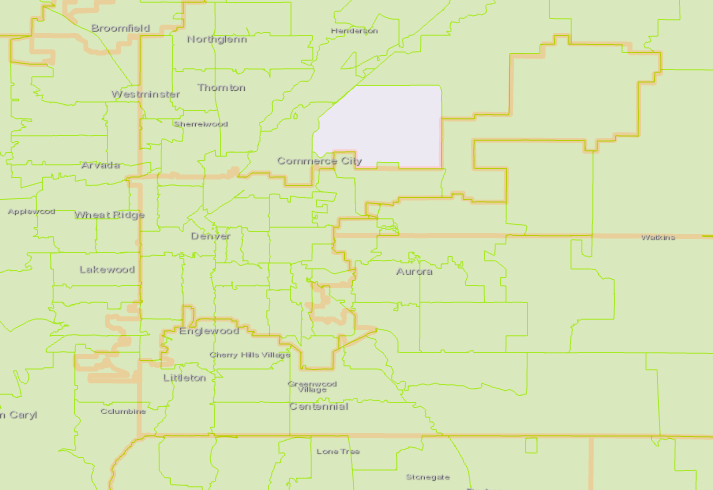
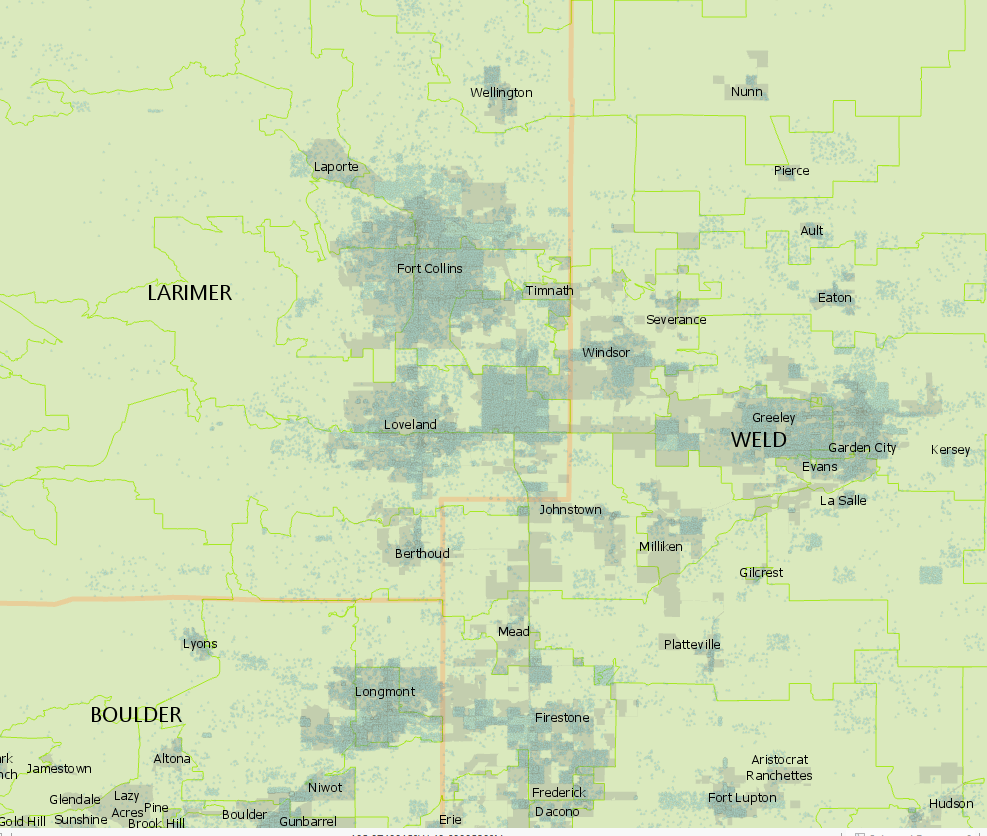

```{r setup, include=FALSE, warning= FALSE, echo=FALSE}
library(tidyverse)
library(knitr)
library(kableExtra)
library(readxl)
library(magrittr)
library(plotly)
library(colorspace)
library(rlist) # list.append()
# helper
`%notin%` <- Negate(`%in%`)
```

# Introduction

USPTO PTMT published [aggregate counts of utility patents by county for years 2000 - 2015](
https://www.uspto.gov/web/offices/ac/ido/oeip/taf/countyall/usa_county_gd.htm). The county location was determined by the city/state locaton provided by the inventor listed first in the patent (the "first position inventor").

As of February 2020, that product hasn't been updated since the 2015 data was added. I assume that product has been discontinued.

Two organizations that I prepare "dashboard" type stats for used those values in their products. They would like the derived metric that uses those estimates to be updated.

To help accomplish this, I wanted to attempt to recreate the analysis for Colorado counties. However, the USPTO methodology notes explain that they used a private, third-party file to crosswalk named city locations to zip codes and then to counties. They also extensively cleaned the published records to ensure the best chance of matching a named place to an actual place that could be crosswalked to the County.

I have two major issues in recreating this:

1. I do not have access to the crosswalk (city-to-zip-to-county) used by the USPTO PTMT. The crosswalk that I have is appropriate for matching Colorado places to counties (including multi-county places), but my crosswalk is not identical to the USPTO crosswalk file. My file has different benefits/weaknesses than the crosswalk used by USPTO PTMT (discussed below)

2. For my purpose (updating a single metric in a small regional economic dashboard product), it is highly impractical to adequately clean a data source of this size to exactly recreate the USPTO PTMT results at any scale of geographic aggregation. To ensure matching, the full data source (all years, all geographic scales; approximately 15 GB per year of raw bibliographic XML files) would need to be cleaned. The geographic scope of my region is represented in a very small percent of these records.

Given these rather large limitations, my goal was to develop a reasonable approximation of the local (Front Range region of Colorado) patent estimate to update the values in our local dashboards that report "patents per 1000 jobs" using the USPTO statistic as the numerator and BLS QCEW total annual average employment levels as the denominator.


This markdown document is a comparison of the results of the two methods. I'm interested in providing both a direct comparison (my estimate, using a public crosswalk, to USPTO PTMT estimate count using a private purchased crosswalk), but also the showing the absolute impact on the actual statistic reported in the dashboard (Patents per worker).

<b> This is a qualitative and plain English exploration/explanation of the differences between these methods and the impact on the derived measure reported in the dashboard. It is not a mathematically rigorous approach. </b>


# USPTO Estimates 

```{r warning= FALSE}
uspto_total <- suppressMessages(read_xlsx("Us_patents_by_state.xlsx", sheet = "Colorado"))

uspto_summary <- read_excel("USPTO_Colorado_County_data.xlsx", sheet = "Colorado")

uspto_summary %<>% select(-`FIPS Code`, -`Mail Code`, -`State or Territory`) %>%
  rename(county_name = `Regional Area Component`) %>%
  arrange(county_name)

# kable((summary(uspto_summary)),
#      caption = "Summary of CO Patents By County, USPTO Methodology (unknown crosswalk)")
```

The USPTO tables can be found here:

* [Utility Patents by State](https://www.uspto.gov/web/offices/ac/ido/oeip/taf/cst_utl.htm)

* [Utility Patents by US County](https://www.uspto.gov/web/offices/ac/ido/oeip/taf/countyall/usa_county_gd.htm)

* [Utility Patents by US MSA](https://www.uspto.gov/web/offices/ac/ido/oeip/taf/cls_cbsa/allcbsa_gd.htm)


In each of these derived products, patents have been classified by type (utility, design, plant). Patents are assigned to a geography by "The geographic distribution of the patents is based on the residence of the inventor whose name appears first on the printed patent (i.e., the first-named inventor)". Inventor details captured in the patent documentation includes city, state and country of residence. The [methodology notes](https://www.uspto.gov/web/offices/ac/ido/oeip/taf/cls_cbsa/explan_cls_cbsa.htm) explain that cities that were not obviously wholly within a county were fractionally assigned to the candidate counties (two county overlap -> 1/2 of the patent is assigned to each)

The process (explained in detail in those notes) matched cities to zip codes, and then zip codes to counties. The methodology notes acknowledge the limitations associated with this type of approach.

The years used for comparison here are limited to 2005 through 2015.  The XML DTD standards differ considerably between 2004 and 2005. I did not develop an extraction script for years 2002 through 2004, despite the XML bibliographic files being available.


# My Estimates for Patents Per County in Colorado

Code and my crosswalk files are provided for extraction of patent bibliography XML files elsewhere in this repository.

[U.S. Patent Bulk Data Files](https://bulkdata.uspto.gov/) provide a weekly record of patent activity. The bibliographic ("front page") files contain patent details including type (design, utility, plant, reissue), classification (ICPR, CPC, etc.; "what the patent is for"), title, inventors, assignees ("owners"), among others. The files are provided as XML with DTD specification.

I extracted all original utility patents from these files. I did not include reissues, which generally are issued several years after the patent. I did not repair any later address corrections made through reissues, because it is difficult to determine if address changes in reissues reflect an error in the original patent that is being corrected, or if the filer is using the opportunity of the reissue to update inventor address. I extracted the list of inventors and their "Addressbook" details (city, state, country). 

Prior to summarizing Colorado (state for 1st listed inventor == 'CO') patents by county, I ran those records through a crosswalk I keep/update/use for common misspellings of Colorado places to standard, correct spelling. Counties were determined using a crosswalk modified from the US Census Bureau Place List, which matches Census places (Cities/Towns/CDPs) to counties. I assigned patents to counties in a similar fractional manner based on first inventor "city" and "state" as the USPTO methodology. Both of my crosswalk files, the "commonly misspelled Colorado places" and the "place-to-county" files are within this repository. R code for accomplishing the extract and the aggregation can also be found in this repository.

```{r warning= FALSE, echo=FALSE}

my_summary <- read_csv("CO_county_patents_aggregated_2020-02-13.csv", col_types = cols())
my_summary %<>% mutate_if(is.numeric, round) %>%
  select(-`2016`, -`2017`, -`2018`, -`2019`) %>%
  arrange(county_name)


# kable(summary(my_summary),
#     caption = "Summary of CO Patents By County, Using My Place-to-County Crosswalk")


```

# Comparing Estimates at the Colorado State Level 

Statewide, my extract is very close to what USPTO produced. Most estimates differ by less than 0.3%. 2010 is a notable exception in terms of magnitude, but the absolute difference is just over 1%. I do not know why 2010 deviates to a greater degree, and with opposite sign (shown in chart below). I checked the obvious potential contributors with no success: all XML files were complete and included in the XML extract and subsequent aggregation. There were not an unusual number of unmatched Colorado places (3 of 2170).


```{r warning= FALSE}

totals <- data.frame(mytotals = colSums(my_summary[, c(2:12)]))
totals %<>% mutate(year = as.numeric(row.names(.)))


all_totals <- left_join(totals, uspto_total, by = c("year"))

all_totals %<>% mutate(
  diff = (mytotals - patent_count),
  diff_as_pct = (mytotals - patent_count) / patent_count
)


plot_ly(all_totals,
  x = ~ as.character(year), y = ~diff_as_pct,
  type = "bar", orientation = "v",
  height = 300
) %>%
  layout(
    title = "(Difference / USPTO) total utility patents in CO by YEAR", bargap = 0.1,
    xaxis = list(title = "", tickangle = 90),
    yaxis = list(title = "difference div by USPTO Estimate"),
    font = list(size = 8)
  )
```


The level of data cleaning involved is a likely contributor to any differences. I did not incorporate any potential changes made in corrections to the patent. I also did not correct for anything other than spelling mistakes in city names in Colorado inventor records.


I did not correct any mistaken state assignments. So, there are a handful of CA cities in the "Unknown" Colorado county estimates, but I also did not correct any Colorado cities that were listed as being in another state. For example, there is a record where the first inventor is assigned to "Fort Collins" in a non-Colorado state. That state doesn't appear to have a city called "Fort Collins", and an internet search for the name and expertise shows the inventor being located in Fort Collins, Colorado. This type of error was not repaired for my analysis. 

In this particular project, it is infeasible for me to either access an existing (private, paid) crosswalk or create (time, scope of my work) a good (robust, persistently useful) place name crosswalk that appropriately assigns all cities/towns/CDP/unincorporated places in the US to the proper state and fully addresses common spelling errors across so many geographic areas.


Some challenges with the data set includes errors in the inventor fields. Examples:

* some "Colorado" (state abbrev: "CO") state records are erroneously classified and should be recorded as the country Colombia (country abbrev: "CO"). Bogotá is not a city in Colorado

* some records placed in "CO" are really from cities in "CA", "CT" and other states (and vice versa)

* some place names are really ambiguous, because the city appears in multiple states, so an incomplete record could be from anywhere (Loveland -- is it Ohio? Is it Colorado?)

* some records are missing values within the addressbook

* place data (the "city" listed by the inventor) isn't standardized and therefore subject to human entry error.

The USPTO team appears to have done extensive cleaning of the data, including a considerably amount of hand cleaning.

However (luckily), the totals attributed to Colorado are pretty close between my summarized extraction and the USPTO product.


# County Estimates for Utility Patents - Differences by Method


The USPTO report only includes 58 of the 64 counties in Colorado, excluding counties that had "0" assignments throughout the entire time series covered by the report (2002 through 2015).

My set additional includes a "Unknown" county that aggregates all leftover records that couldn't be assigned to a specific county (place unknown in Colorado).


```{r warning= FALSE}

# non-matching rows need to get dropped
x <- unique(my_summary$county_name)[which(unique(my_summary$county_name) %notin% unique(uspto_summary$county_name))]


my_summary %<>% filter(my_summary$county_name %notin% x)


mine_tidy <- gather(my_summary,
  value = "patents", key = "year",
  c(as.character(c(2005:2015)))
)

uspto_tidy <- gather(uspto_summary,
  value = "patents", key = "year",
  c(as.character(c(2005:2015)))
)


join_tidy <- left_join(mine_tidy, uspto_tidy, by = c("county_name", "year")) %>% rename(patents = patents.x, uspto_patents = patents.y)

join_tidy %<>% mutate(
  diff = (patents - uspto_patents),
  diff_pct = ifelse(
    is.infinite(patents - uspto_patents) / uspto_patents,
    NA,
    (patents - uspto_patents) / uspto_patents
  )
)

msa_to_county <- read_excel("msa_to_county.xlsx")

join_tidy %<>% left_join(msa_to_county, by = ("county_name"))


kable(summary(join_tidy))
```

```{r warning = F, message = F}
plot_ly(x = join_tidy$diff_pct, type = "histogram", width = 600, height = 250) %>%
  layout(title = "Histogram of estimate difference as percent of USPTO estimate")
```

The majority of my estimates (single county, single year) are within +/- 5% of USPTO estimates. However, this is because the counties with the least number of patents are generally the ones that have matching (or nearly matching) estimates.


```{r}
by_county <- join_tidy %>%
  group_by(county_name) %>%
  summarize(
    mean_diff_pct = mean(abs(diff_pct), na.rm = TRUE),
    n_diff = sum(!(is.na(diff_pct))),
    n_uspto = sum(uspto_patents),
    n_mine = sum(patents)
  )

plot_ly(by_county, height = 200, width = "100%") %>%
  add_trace(
    x = ~ gsub("County", "", county_name), y = ~n_mine, name = "My estimate",
    type = "bar", orientation = "v"
  ) %>%
  add_trace(
    x = ~ gsub("County", "", county_name), y = ~n_uspto, name = "USPTO estimate",
    type = "bar", orientation = "v"
  ) %>%
  layout(
    title = "Comparison of total patents per county 2005-2015 by each methods", bargap = 0,
    xaxis = list(title = "", tickangle = 90),
    yaxis = list(title = "sum"),
    font = list(size = 7)
  )

# create a bar plot of boring ones (closely match within 1 patent)
# create some kind of nice plot for the interesting ones.
```

When all observations across years are aggregated by county, the notable differences are primarily in larger, more urban counties or counties that border an urban county.


```{r warning = FALSE}

plot_ly(by_county,
  x = ~ gsub("County", "", county_name), y = ~mean_diff_pct,
  type = "bar", orientation = "v",
  height = 250
) %>%
  layout(
    title = "Mean (Difference / USPTO estimate) by county", bargap = 0,
    xaxis = list(title = "", tickangle = 90),
    yaxis = list(title = "mean (difference div by USPTO Estimate)"),
    font = list(size = 7)
  )
```

Denver is an obvious outlier (discussed more below)

I think it interesting that Elbert County appears as an outlier here. Elbert is primarily low-density and rural, but it is within the Denver-Aurora-Lakewood MSA. Elbert has several zip codes that overlap into neighboring Douglas County (west) and Arapahoe County to the North. Several towns and cities abut Elbert (Parker, Castlerock, Aurora), but do not actually cross the county line. Some zip codes, interpreted as ZTCAs, serving those cities/towns do.

Gilpin is a very mountainous and small (for Colorado) county on the north west side of Denver Metro. It is part of that MSA as well. It has population of about 6000. 

In both of these cases, it appears that very small numbers of patents assigned to these counties (relative to a larger population center) create large percent differences due to the differences in fractional county assignment by method.


```{r}
by_year <- join_tidy %>%
  group_by(year) %>%
  summarize(
    mean_diff_pct = mean(abs(diff_pct), na.rm = TRUE),
    n = sum(!(is.na(diff_pct)))
  )

plot_ly(by_year,
  x = ~ as.character(year), y = ~mean_diff_pct,
  type = "bar", orientation = "v",
  height = 250
) %>%
  layout(
    title = "Mean ABS(Difference / USPTO estimate) by YEAR", bargap = 0.1,
    xaxis = list(title = "", tickangle = 90),
    yaxis = list(title = "mean Abs(difference div by USPTO Estimate)"),
    font = list(size = 7)
  )
```

# Differences at the county and year level

The chart below only includes counties that have both more than 10 USPTO patents total during 2005  through 2015 and the mean difference expressed as a proportion of the USPTO estimate is greater than .01. visibility of series year can be toggled in the legend.

This highlights that some counties are more likely to see large deviations between methods (expressed as percent) than others. Hovering over a bar exposes the patent estimates by both methods. 


```{r warning = FALSE}


higher_est_counties <- by_county %>% filter(n_uspto > 10, mean_diff_pct > 0.01)

the_years <- unique(join_tidy$year)

the_plot <- plot_ly(type = "bar", orientation = "v", height = 350)

for (a_year in the_years) {
  year_df <- join_tidy %>% filter(
    year == a_year,
    county_name %in% higher_est_counties$county_name
  )
  visibility <- if_else(a_year %in% c(2005:2010), "TRUE", "legendonly")

  the_plot <- the_plot %>%
    add_trace(
      x = gsub("County", "", year_df$county_name),
      y = year_df$diff_pct,
      name = a_year, visible = visibility,
      hover = "text",
      text = paste(
        "<br />est. patents: ", year_df$patents,
        "<br />est. uspto patents: ", year_df$uspto_patents
      )
    )
}

the_plot <- the_plot %>%

  layout(
    title = paste0("Difference / USPTO estimate by county and year"), bargap = 0,
    xaxis = list(title = "", tickangle = 90),
    yaxis = list(title = "difference div by USPTO Estimate"),
    font = list(size = 7)
  )
the_plot
```


## Why Does Denver Deviate So Much?


```{r}

denver_cty <- join_tidy %>% filter(county_name == "Denver County")

plot_ly(denver_cty,
  x = ~ as.character(year), y = ~diff_pct,
  type = "bar", orientation = "v",
  hoverinfo = "text",
  text = ~ paste(
    "<br />est. patents: ", patents,
    "<br />est. uspto patents: ", uspto_patents
  ),
  height = 200
) %>%
  layout(
    title = "(Difference / USPTO estimate) by YEAR", bargap = 0.1,
    xaxis = list(title = "", tickangle = 90),
    yaxis = list(title = "difference as proportion of USPTO Estimate"),
    font = list(size = 7)
  )
```

Patents classifed to Denver County are the most concentrated source of deviations (proportional) between my estimate and the USPTO estimates.

This isn't unexpected, given the "place name" to "county" crosswalk practice used by USPTO as compared to using my crosswalk, which is an augmented version of the U.S. Census Bureau's Place-to-county crosswalk. My crosswalk has commonly used non-Census places in Colorado. These places are typically unincorporated, non-CDPs that relate to an area served by a post office.

{width=500px}

Denver is both a city and a county in Colorado. This map shows the county boundaries (Denver is center) in a thick orange line and ZTCAs in thin green. A zip code does not have administrative boundaries. It is defined by a mail route. [The Census Bureau created Zip Code Tabulation Areas (ZTCAs) by essentially drawing boundaries around those route areas and assigning the zip code as the area's unique ID](https://www.census.gov/programs-surveys/geography/guidance/geo-areas/zctas.html)

The USPTO method mapped a named place ("Denver") to associated zip codes, and crosswalked to counties that the zip codes overlap, with equal weight attributed to each county included in the place-to-zip-to-county. All inventors who list "Denver" as their place of residence have patents allocated across multiple counties.

By using a Cenus place-to-county direct crosswalk at the core of the allocation, all inventors who list "Denver" as their place of residence have patents are allocated to one county: Denver.

The estimate difference for Denver is consistently positive (my estimate is higher). This is consistent with the fact that my crosswalk will always allocate the entire patent to the Denver patent estimate for a "Denver" inventor. The USPTO method will assign that one patent to all counties that have a zipcode that overlaps Denver. I did not attempt to identify which or calculate how many zipcodes overlap counties in Colorado.


### Issues associated with using zipcodes as an intermediate step in place-to-county crosswalks

Both crosswalk approaches used in either of these approaches have issues. USPTO PTMT used place-name-to-zip-to-county approach. I used a place-name-to-county approach. 

A zipcode can overlap multiple places. For example, 80227 overlaps the City of Lakewood (Jefferson County) and the City/County of Denver (Denver County). Where do people in that zip code report themselves as living on paperwork? Is that even consistent? I don't know.

Additionally, the direct comparison still isn't perfect when the patent gets fractionally assigned to the overlapping counties. The Town of Berthoud spans both Larimer and Weld counties. Very few people live or work on the Weld county side. Is it fair that a patent from an inventor in Berthoud is equally attributed to both Larimer and Weld? The same issue applies to single zip codes in this case as well, because Berthoud has 1 representative zip code.

It also continues to be problematic the assumption that the "innovation" of a patent "belongs" to the residence of the first inventor. Should other inventors on the patent receive some credit for their residence? Should the "credit" really go to the location of the patent assignee (which may be in a place that none of the inventors live)?

This is obviously beyond scope, but worth consideration.


# Looking at Patent Estimates By MSA 


Metropolitan Statistical Areas (MSAs) are aggregated at county or county-equivalent boundaries. They typically encompass an urban core and related suburbs and smaller cities. 

Colorado has 7 MSAs that include the vast majority of the state's population. 

Five of the 7 MSAs are each contiguous with a single county. MSAs are generally named for the principle city in that county. The Denver MSA comprises 10 counties. The Colorado Springs MSA comprises 2 counties. 

```{r warning= FALSE }

msa_summary <- join_tidy %>%
  group_by(MSA, year) %>%
  summarize(
    patents = sum(patents),
    n_counties = n()
  )

# USPTO uses an older verion of MSA long form name for Denver
#  and also Fort Collins. I hand-corrected this to match
# the current long form name. The geographic definition
# remains the same across the naming conventions in the data years used here.
uspto_msas <- read_xlsx("uspto_patents_by_msa.xlsx", sheet = "CO MSAs")


uspto_msas %<>% select(-`ID Code`, -`U.S. Regional Level`, -`Total`) %>%
  arrange(MSA)


uspto_msas_tidy <- gather(uspto_msas,
  value = "uspto_patents",
  key = "year",
  c(as.character(c(2005:2015)))
)

msas_tidy <- left_join(msa_summary, uspto_msas_tidy,
  by = c("year", "MSA")
)

msas_tidy %<>% filter(!is.na(`MSA`))

msas_tidy %<>% mutate(
  diff = (patents - uspto_patents),
  diff_pct = ifelse(
    is.infinite(patents - uspto_patents) / uspto_patents,
    NA,
    (patents - uspto_patents) / uspto_patents
  )
)

by_msa <- join_tidy %>%
  group_by(MSA) %>%
  summarize(
    n_uspto = sum(uspto_patents),
    n_mine = sum(patents),
    diff = n_mine - n_uspto,
    diff_pct = diff / n_uspto,
  )
by_msa %<>% filter(!is.na(MSA))


plot_ly(by_msa, height = 200, width = "100%") %>%
  add_trace(
    x = ~MSA, y = ~n_mine, name = "My estimate",
    type = "bar", orientation = "v"
  ) %>%
  add_trace(
    x = ~MSA, y = ~n_uspto, name = "USPTO estimate",
    type = "bar", orientation = "v"
  ) %>%
  layout(
    title = "Comparison of total patents per MSA 2005-2015 by each method", bargap = 0,
    xaxis = list(title = "", tickangle = 90),
    yaxis = list(title = "sum"),
    font = list(size = 7)
  )
``` 


```{r warning=FALSE}

denver_msa <- msas_tidy %>% filter(MSA == "Denver-Aurora-Lakewood, CO")


plot_ly(height = 250, type = "bar", orientation = "v") %>%
  add_trace(
    x = as.character(denver_msa$year),
    y = denver_msa$diff_pct,
    name = "Denver-Aurora-Lakewood, CO MSA"
  ) %>%
  add_trace(
    x = as.character(denver_cty$year),
    y = denver_cty$diff_pct,
    name = "Denver County"
  ) %>%
  layout(
    title = "% different from USPTO estimate",
    bargap = 0.1,
    xaxis = list(title = "", tickangle = 90),
    yaxis = list(title = "difference expressed as proportion of USPTO estimate"),
    font = list(size = 7)
  )
```


When aggregating the patent esimate to MSA instead of county, the Denver MSA differences are much smaller than the county scale differences. 

There are generally more patents with inventors living in urban areas. Urban geography is more likely to have a larger number of municipalites that cross county lines (simply due to having more people and more cities/towns in close proximity than a very sparsely populated rural area). 

The net result of this: more of the "overlaps" between counties get ironed out when aggregated at the MSA level, because its more likely that the entirety of the inventor's stated "city" (or "city mapped as one or more zip codes") falls within the MSA than within a specific county.


## Colorado Springs (El Paso and Teller Counties)

The City of Colorado Springs is in El Paso County. The Colorado Springs MSA contains both El Paso and Teller Counties.

```{r warning=FALSE}

elpaso_cty <- join_tidy %>% filter(county_name == "El Paso County")
cosprings_msa <- msas_tidy %>% filter(MSA == "Colorado Springs, CO")

plot_ly(height = 250, type = "bar", orientation = "v") %>%
  add_trace(
    x = as.character(cosprings_msa$year),
    y = cosprings_msa$diff_pct,
    name = "Colorado Springs, CO MSA"
  ) %>%
  add_trace(
    x = as.character(elpaso_cty$year),
    y = elpaso_cty$diff_pct,
    name = "El Paso County"
  ) %>%
  layout(
    title = "% different from USPTO estimate",
    bargap = 0.1,
    xaxis = list(title = "", tickangle = 90),
    yaxis = list(title = "difference expressed as proportion of USPTO estimate"),
    font = list(size = 7)
  )
```

MSA (2 county) vs. 1 county (El Paso), doesn't appear to systematically impact results for this MSA; However the magnitude of difference that occurs by using one vs the other geographic aggregation scales is much smaller for the El Paso County and Colorado Springs MSA comparison.


# Comparison of "Patents per 1000 Jobs" at the MSA level

The measure of interest from my organization is "patents per 1000 jobs" rounded to 1 decimal place. This is not a perfect measure:

* Each patent is attributed to the first inventor's location, which may not be the most appropriate location. Alternatives might be the majority of inventors or the location of the patent's assignee (often the organization that paid for the work that led to the patent).

* The residence of the inventor may not be the same as the work location or sponsoring organization. 

* Fractional attribution of "city" to county has already been shown to be problematic for multiple reasons (described above, and also in the USPTO PTMT methodology document).

* "Jobs" uses the B.L.S. QCEW annual employment estimates. This source includes UI eligible employee counts per geography (such as MSA). Some areas import large portions of their workforce from surrounding communities. Some portion of patented work is produced by individuals who would not be included in the jobs estimate.


Alternative measures (such as patents per population) are equally problematic for several of the same reasons and others:

* Additionally, is it appropriate to normalize patents against a population that skews toward lower work or economic productivity (areas with larger portions of youth or retired persons)?


Given that this measure isn't "exact" and it is used to generally compare and describe trands impacting regions over time in a more casual way, rather than for some type analysis with any risk or stakes, I just want the general trend and outcome to be similar to the USPTO product and be something that can be used into the future for these two data products and reproduced and updated by others.

The chart below is a "barbell" panel plot showing a timeseries of derived measure estimates for each of the MSAs. The USPTO estimate for each city is shown in gray. A "barbell" line connects the two estimates for each city. Where the difference is small, the barbell is small, or not visible. Where the difference is large, the barbell stretches vertically.

Hovering over any point will show multiple associated values: the derived measure estimate by both methods and the patent estimate by both methods.


```{r warning=FALSE, message=FALSE, fig.height=14}
# Census MSA fips

co_msas <- read_csv("CO_MSAs.csv")
co_msas %<>% mutate(bls_fips = paste0("C", substr(FIPS, 1, 4)))

# QCEW total works for
CO_qcew_data_2005_to_2015 <- read_csv("CO_qcew_data_by_MSA_2005_to_2015.csv")

jobs <- CO_qcew_data_2005_to_2015 %>% select(area_fips, year, annual_avg_emplvl)

by_msa_year <- join_tidy %>%
  group_by(MSA, year) %>%
  summarize(
    n_uspto = sum(uspto_patents),
    n_mine = sum(patents),
    diff = n_mine - n_uspto,
    diff_pct = diff / n_uspto
  )
by_msa_year %<>% filter(!is.na(MSA))

by_msa_year %<>% left_join(co_msas, by = c("MSA" = "NAME"))
by_msa_year %<>% mutate(year = as.numeric(year))
by_msa_year %<>% left_join(jobs, by = c("year" = "year", "bls_fips" = "area_fips"))

by_msa_year %<>% mutate(
  pts_per_1k_mine = round(n_mine / (annual_avg_emplvl / 1000), 1),

  pts_per_1k_uspto = round(n_uspto / (annual_avg_emplvl / 1000), 1),
  measure_diff = pts_per_1k_mine - pts_per_1k_uspto,
  measure_diff_pct = measure_diff / pts_per_1k_uspto
)


# BARBELL SUBPLOT
msa_names <- unique(by_msa_year$MSA)
len <- length(msa_names)
color_list <- rainbow_hcl(len)

plots <- list()
annots <- list()


for (i in c(1:len)) {
  show_uspto_leg <- ifelse(i == len, TRUE, FALSE)

  msa_name <- msa_names[i]
  df <- by_msa_year %>% filter(MSA == msa_name)

  the_plot <- plot_ly(df,
    hoverinfo = "text",
    text = ~ paste(
      "</br>", MSA,
      "<br /> estimate per 1k: ", pts_per_1k_mine,
      "<br /> USPTO estimate per 1k: ", pts_per_1k_uspto,
      "<br /> difference: ", round(measure_diff, 2),
      "<br /> patent # estimate: ", n_mine,
      "<br /> uspto patent # est: ", n_uspto
    )
  ) %>%
    add_segments(
      x = ~year, xend = ~year,
      y = ~pts_per_1k_uspto, yend = ~pts_per_1k_mine,
      color = I("#AAAAAA"),
      opacity = .4,
      showlegend = FALSE
    ) %>%
    add_markers(
      x = ~year, y = ~pts_per_1k_mine,
      name = paste0(msa_name, " est. patents / 1K jobs"),
      color = I(color_list[i]),
      opacity = .9,
      showlegend = TRUE,
      legendgroup = ~MSA
    ) %>%
    add_markers(
      x = ~year, y = ~pts_per_1k_uspto,
      name = "USPTO patents / 1K jobs",
      color = I("#AAAAAA"),
      opacity = .4,
      showlegend = show_uspto_leg,
      legendgroup = "USPTO"
    ) %>%
    layout(
      annotations = list(
        x = 0.01, y = 1.01,
        text = msa_name,
        showarrow = F, xref = "paper", yref = "paper"
      ),
      yaxis = list(title = "patents per 1k jobs")
    )

  plots %<>% list.append(the_plot)
}


fig <- subplot(plots, nrows = length(plots))

fig <- fig %>% layout(
  title = "Comparison of Patents per 1K job by Patent Estimate Source",
  widths = 1,
  heights = (1 / len - .1), shareX = TRUE, titleX = TRUE,
  showlegend = FALSE,
  legend = list(x = 100, y = 0.5)
)


fig
```

The derived measure divides the patent estimate by "thousands of jobs" (jobs/1000) rounded to 1 decimal place. This means that very small absolute differences between the two estimates can essentially dissapear due to rounding in the final measures.

The derived measure exhibits differences in a subset of the MSAs. Boulder (Boulder County), Fort Collins (Larimer County), and Greeley (Weld County) all noticably differ from the USPTO derived measure.The relative trend remains the same across each of the MSAs. Fort Collins generally shows small gains while Greeley shows small decreases, relative to the USPTO PTMT estimate.  

These counties/MSAs also have dense urban areas that are geographically clustered along the boundaries of the counties.

## A gut check on the differences in the Northern Front Range.
{width=800px}

This map is a screenshot from ArcGIS Pro, using TIGER Files (green ZTCA boundaries, orange county lines, gray areas for named Census Places, blue dots are Census LODES work locations (jittered in Blocks)). It highlights that there are several places that from a "name" standpoint are probably within 1 county, but by zip-code-to-name crosswalk would be divided between the counties. 

The blue dots (job locations) are included to highlight where our populations generally live and work in the area. The majority of jobs (dots) cluster in areas that are part of a named Census place, but there are some areas where residents and businesses would use a name for the geography that isn't captured in the Census layer. These locations are named in the crosswalk and mapped to counties. 

While it would be more convenient (from my perspective and for my dashboard users' perspectives) for my estimates to more closely resemble the USPTO PTMT estimates, the differences between the methods largely make sense and are generally comparable. My estimate may be more representative of the county of the first inventor on the utility patents for Larimer and Weld Counties, but that generalization may not hold in other areas, and my method has significant limitations for any area outside of Colorado.


